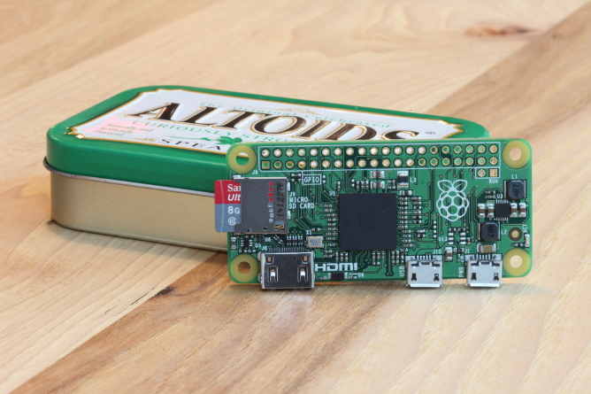
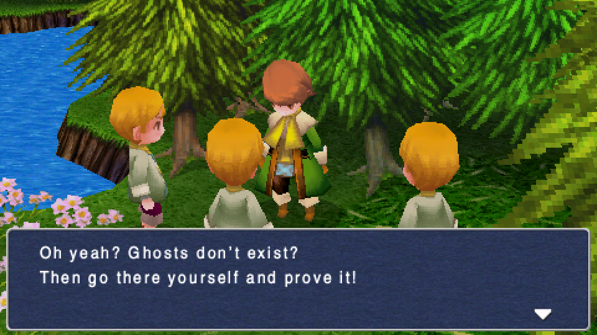

Two weeks have passed since the last major release. It's time for a bugfix version.

## Experimental Raspberry Pi Zero port

The new low cost version of the first Raspberry Pi was released 10 days ago. This version is very small, and very cheap ($5). It's already out of stock. We were not lucky enough to get one, but we upgraded our RPi build with the latest bootloader and kernel to make Lakka compatible with the tiny board.

Some users on twitter and on the forum tested the image, and were able to boot it. We will add the Raspberry Pi Zero to our installation tutorial when we can buy one or when we receive a unit as a donation. In the meanwhile, just use the RPi image and adapt the instructions to the specifications of the Zero (no Ethernet port to transfer the ROMs over the network).

## PSP emulator packaged for Raspberry Pi 2

There was this GLES3 header conflict preventing us from packaging the PPSSPP emulator for the RPi2 release. It turns out we just had to update the videocore package to fix this. The new images ship with PPSSPP which performs surprisingly well. I've been able to play lightweight games like Final Fantasy 3 almost at full speed, with all the speed hacks enabled in the core options.

## Bugfixes

We fixed a display bug in the menu. That bug was causing icons to stack at the bottom of the screen. Another bug caused users to get stuck in the privacy settings has been fixed too. 

Also, some wrong core association for the playlists were corrected, so you will need to refresh your retroarch.cfg after upgrading. This should fix supergrafx ROMs not launching.

We now use snes9x by default instead of snes9x-next on the PC builds. This core should be fast enough on PC, and it has better compatibility and multitap support.

Our documentation has been updated with explanations on how to write or generate your own playlists.

Thanks a lot to all the users that sent us bug reports and reviews about the latest release, it helped a lot.

A new bugfix release will come in the next few weeks, Stay tuned.
